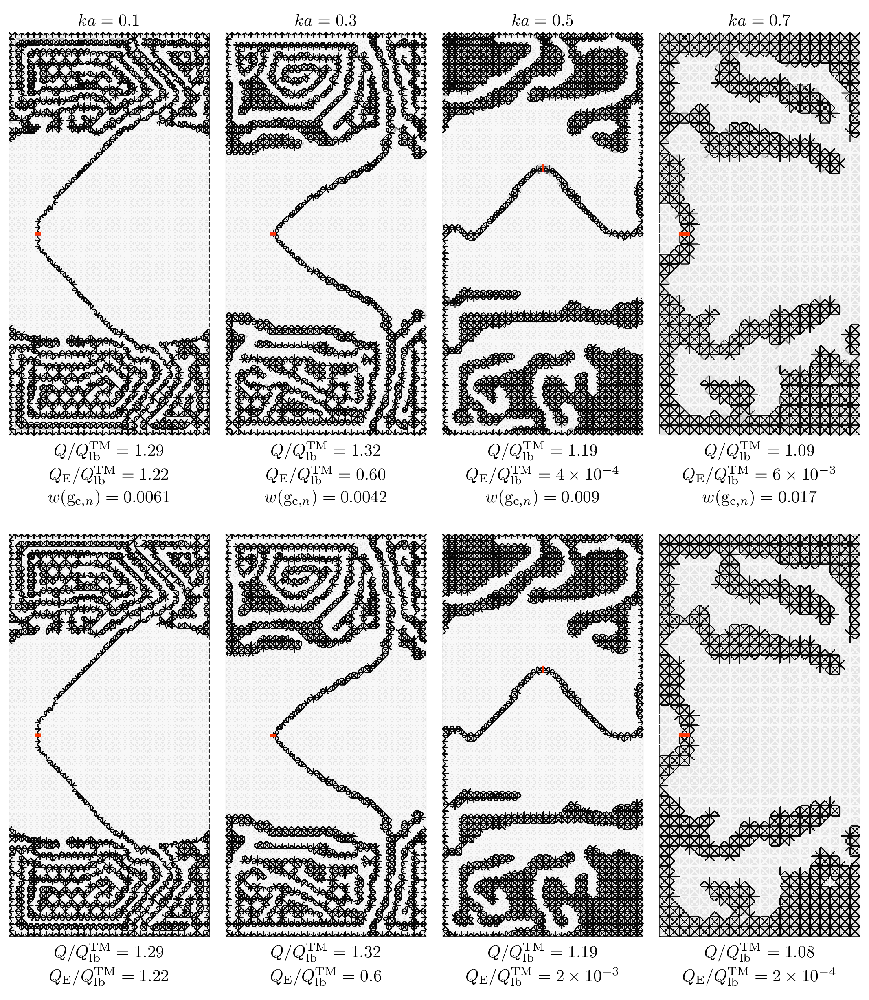
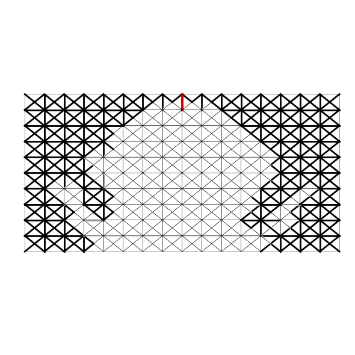
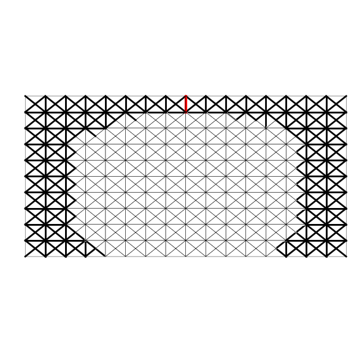

# Antenna Q-Factor Topology Optimization with Auxiliary Edge Resitivities

Python and Matlab implementation of Antenna Q-Factor Topology Optimization with Auxiliary Edge Resitivities. 

This is an antenna topology optimization code designed to minimize Q-factor of electrically small antennas within the EFIE method-of-moments (MoM) RWG paradigm. 

## Installation
Clone the repository and install dependencies using Conda and .yml environment snapshot

```console
$ conda env create -f environment.yml -n <my_env_name>
```

## How does it work?
The package uses AToM (see [1]) MoM matricies to optimize antenna topologies using gradient descent and automatic differentiation implemented in PyTorch. Additionally, the code provides bi-level optimization approach using Bayesian optimization (see [2]) that optimizes the position of the delta-gap feeding and the optimizer hyperparameters.

Sample data for antenna of electrical size $ka = 0.8$ and discretization $16\times10$ ($N = 934$, where $N$ is the number of degrees of freedom) are available in the Data folder. The data come with the MoM matricies and two density filters H. 

The local algorithm implemented in [AER](./local_algorithm.py) required to know:
- the learning rate
- the weight decay
- maximum thresholding parameter
- maximum steps per thresholding level
- mode: {"filter1", "filter2"} - changes the index of H matrix for different filters

You can run the local algorithm by executing file [run](./run_local_alg.py). The parameters can be set using CLI or inside editor.

The results of the optimization are save into .pth files carrying the optimized vector and an optimization log is saved into .csv file.

Post-processing can be done using the interactive python script [processor](./result_processor.py). Just set the paths of the .pth and .csv files correctly and select the appropriate filer and thresholding parameter.

For the two filters available and,
- the learning rate - 0.05;
- the weight decay - 1e-3;
- maximum thresholding parameter - 64;
- maximum steps per thresholding level - 2100,
the obtained results for filter radiuses $r_1 = 0.15a$ and $r_2 = 0.2a$ are 

$r_1$             |  $r_2$
:-------------------------:|:-------------------------:
  |  
$Q/Q_\textrm{lb}^\textrm{TM} = 1.08$ | $Q/Q_\textrm{lb}^\textrm{TM} = 1.06$
$Q_\textrm{E}/Q_\textrm{lb}^\textrm{TM} = 8.5\times 10^{-4}$ | $Q_\textrm{E}/Q_\textrm{lb}^\textrm{TM} = 1.5\times 10^{-5}$

The results were obtained in $585$ s and $603$ s respectively on M1 Apple Silicon machine with 16GB of RAM. 


## References
[1] Antenna Toolbox for MATLAB (AToM), [on-line]: [www.antennatoolbox.com](http://antennatoolbox.com/index), (2025)

[2] Bayesian optimization, [on-line]: [BayesianOptimization](https://github.com/bayesian-optimization/BayesianOptimization/tree/master), (2025)