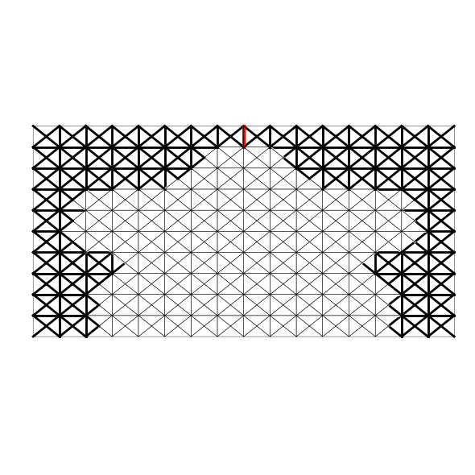
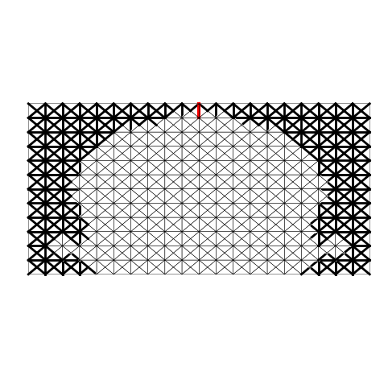

# Antenna Q-Factor Topology Optimization with Auxiliary Edge Resitivities

Python and Matlab implementation of Antenna Q-Factor Topology Optimization with Auxiliary Edge Resitivities. 

This is an antenna topology optimization code designed to minimize Q-factor of electrically small antennas within the EFIE method-of-moments (MoM) RWG paradigm. 

## Installation
Clone the repository and install dependencies using Conda and .yml environment snapshot

```console
$ conda env create -f environment.yml -n <my_env_name>
```

## How does it work?
The package uses AToM (see [1]) MoM matricies to optimize antenna topologies using gradient descent and automatic differentiation implemented in PyTorch. Additionally, the code provides bi-level optimization approach using Bayesian optimization (see [2]) that optimizes the position of the delta-gap feeding and the optimizer hyperparameters.

Sample data for antenna of electrical size $ka = 0.8$ and discretization $16\times10$ ($N = 934$, where $N$ is the number of degrees of freedom) are available in the Data folder. The data come with the MoM matricies and two density filters H. 

The local algorithm implemented in [AER](./local_algorithm.py) requires:
- the learning rate
- the weight decay
- maximum thresholding parameter
- maximum steps per thresholding level
- mode: {"filter1", "filter2"} - changes the index of H matrix for different filters
- maximum gamma - the binary regularization
- di : float - self-resonance regularization
- plot: bool - shows the structure update and loss progress in a plot

You can run the local algorithm by executing file [run](./run_local_alg.py). The parameters can be set using CLI or inside editor.

The results of the optimization are saved into .pth files carrying the optimized vector and an optimization log is saved into .csv file.

Post-processing can be done using the interactive python script [processor](./result_processor.py). Just set the paths of the .pth and .csv files correctly and select the appropriate filter and thresholding parameter beta.

For the two filters available and,
- the learning rate - 0.5 | 0.7;
- the weight decay - 0.009 | 0.01;
- maximum thresholding parameter beta - 32;
- maximum steps per thresholding level i_max - 82 | 75,
- maximum gamma - 0
- di (self-resonance regularization) - 0
the obtained results after thresholding for filter radiuses $r_1 = 0.15a$ and $r_2 = 0.2a$ are 

$r_1$             |  $r_2$
:-------------------------:|:-------------------------:
  |  
$Q/Q_\textrm{lb}^\textrm{TM} = 1.08$ | $Q/Q_\textrm{lb}^\textrm{TM} = 1.07$
$Q_\textrm{E}/Q_\textrm{lb}^\textrm{TM} = 0.1$ | $Q_\textrm{E}/Q_\textrm{lb}^\textrm{TM} = 0.02$

The results were obtained in $15$ s and $14$ s respectively on M1 Apple Silicon machine with 16GB of RAM. 

To obtain the result from the paper (Fig. 6 and Fig. 7) we further provide data for $ka=0.8$ and domain~$20\times 12$. 

To achieve the results the value of initial beta must be 1 -- set it in the local_algorithm.py, there is no way to modify this parameter from the input arguments. For the other parameters:
- the learning rate - 0.83;
- the weight decay - 0.0077;
- maximum thresholding parameter beta - 32;
- maximum steps per thresholding level i_max - 62,
- maximum gamma - 0
- di (self-resonance regularization) - 0

 

$Q/Q_\textrm{lb}^\textrm{TM} = 1.06$, $Q_\textrm{E}/Q_\textrm{lb}^\textrm{TM} = 0.045$

## References
[1] Antenna Toolbox for MATLAB (AToM), [on-line]: [www.antennatoolbox.com](http://antennatoolbox.com/index), (2025)

[2] Bayesian optimization, [on-line]: [BayesianOptimization](https://github.com/bayesian-optimization/BayesianOptimization/tree/master), (2025)